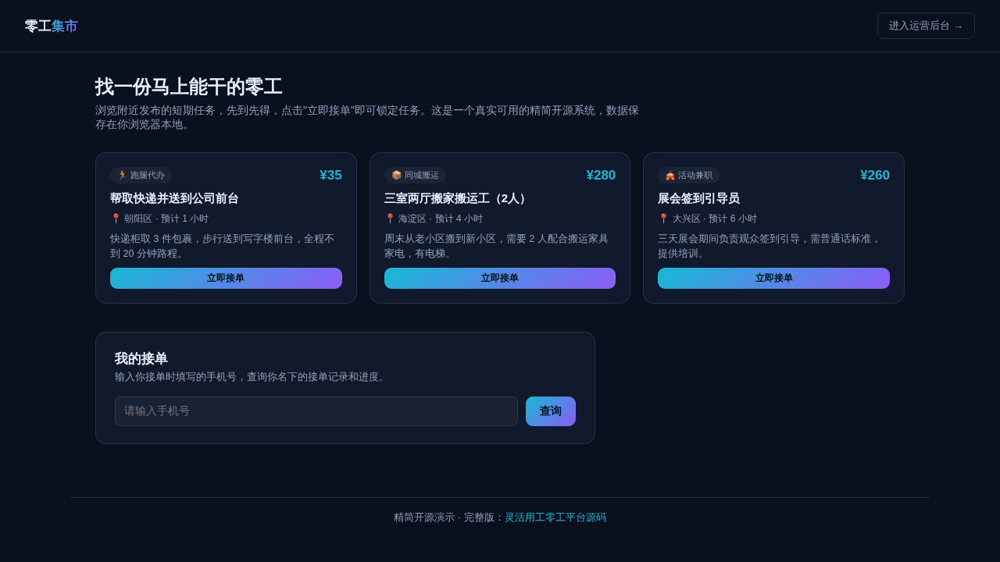

# 灵活用工零工平台（精简开源版）· GigWork Lite

**[在线体验（前台）→](https://anna123123123-creator.github.io/gigwork-lite/)** · **[运营后台 →](https://anna123123123-creator.github.io/gigwork-lite/admin.html)**

免费开源的灵活用工零工平台精简版。这不是截图或原型图，是一个**真实可用**的前后台系统：任务浏览、先到先得一键接单、接单进度查询，后台任务增删改查、结算管理、真实的数据看板——都是真功能，纯前端 + `localStorage` 实现，不需要服务器、不需要数据库，克隆下来打开就能用，也适合作为学习或二次开发的起点。



## 功能

**前台（零工工人视角）**
- 浏览当前可接的零工任务：标题、分类、地点、报酬、预计工时、任务说明
- 点击"立即接单"在线提交姓名和手机号即可锁定任务
- 真实的并发保护：提交接单时会重新读取最新数据校验任务是否仍为"待接单"状态，如果已被别人抢先接走会给出明确的错误提示，不会产生重复接单
- "我的接单"：输入手机号查询自己名下的所有接单记录和实时状态

**后台（平台运营视角）**
- 仪表盘：任务总数、待接单/进行中任务数、本月已完成任务总收入（按完成时间实时计算）、收入榜 Top 工人（按姓名+手机号聚合已完成任务的报酬）
- 任务管理：新增、编辑、删除零工任务
- 结算管理：查看全部接单记录，按状态筛选，一键将进行中的任务标记为已完成以完成结算

## 试用方法

克隆下来，直接用浏览器打开 `index.html`，或用静态文件服务器跑起来：

```bash
python3 -m http.server 8000
```

前台在 `index.html`，后台在 `admin.html`。所有数据存在浏览器的 `localStorage` 里（`gigwork_lite_data_v1` 这个 key），后台侧边栏有"重置示例数据"按钮可以随时清空重来。

## 技术说明

没有用任何框架或构建工具，纯原生 HTML/CSS/JavaScript，一共 4 个文件：`data.js`（数据层，负责 localStorage 读写和种子数据）、`index.html` + `script.js`（前台）、`admin.html` + `admin.js`（后台）。因为是纯前端 Demo，数据只存在当前浏览器里，不同设备/浏览器之间不会同步，也没有任何身份认证或支付能力——真实生产系统需要一个后端 API、数据库、身份认证体系以及真实的支付结算通道来替换 `data.js` 里的存储层，其余的界面和交互逻辑基本可以直接复用。

## 协议

MIT，随便怎么用都行。

## 需要定制版？

这个工具免费开源、可以直接用。如果你需要的是**改造成适合自己业务的版本**——换品牌、改字段、加功能、接后端或数据库——我可以做。

- **交付周期**：3–10 个工作日
- **交付内容**：完整源码（不加密、可自行二次开发）+ 在线地址 + 部署说明
- **已有 49 套现成系统**可直接改造，覆盖电商、教育、门店、内容、跨境等行业：[全部清单与在线演示](https://inzyxuashop.com)

把你的需求发给我，24 小时内回复可行性与报价：**evcdecd@gmail.com**
